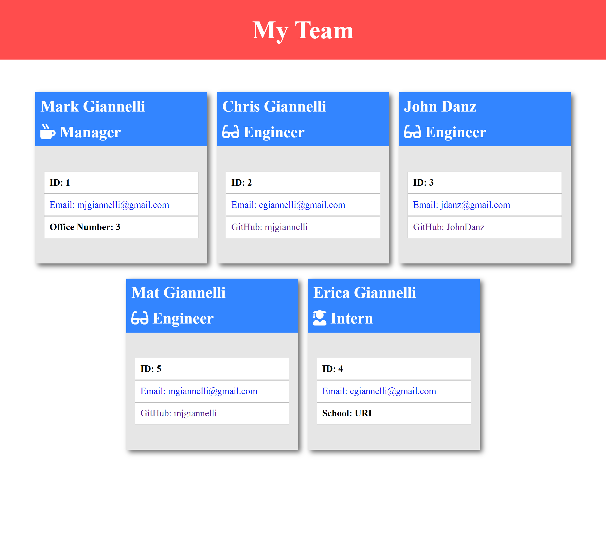

 # Team-Profile-Generator
  
   

  ## Table-of-Contents

  * [Description](#description)
  * [Installation](#installation)
  * [Usage](#usage)
   
  * [Contributing](#contributing)
  * [Tests](#tests)
  * [Questions](#questions)
  
  ## [Description](#table-of-contents)

  My project is a team profile generator. It allows a manager to organize their team, as well as, have their email and other information readily available to the manager

  I created this project for managers that need help organizing their team and have a one stop shop place to pull any information they would like about their employee whenever they would need to.

  A manager will answer prompts regarding their information to generate their employee card. The manager is then presented a menu to add an engineer, an intern or finish building their team. If they select 'add an engineer' or 'add an intern' the manager will be prompted questions regarding the employee to use to generate their employee card. After answering these questions, the manager is then brought back to that same menu. The manager will add as many engineers and interns are on their team. Once they are finished, when they are presented with the menu again they will select 'finish building my team'. That will then cause the program to take the information enetered by the manager and create a webpage displaying their team's employee cards. The manager now has access to the employee's emails or other information whenever they choose.

  ## [Installation](#table-of-contents)

  The manager will have to install node, npm, & inquirer on their computer. Click the repository link below. Download the zip file anClick the repository link below. Download the zip file and copy it to a directory of your choice or clone to a directory of your choice using your terminal.  Open the file in VS Code or whatever editor you work with. Open the terminal in VS Code and make sure you’re in the root directory 'challenge-10-team-profile-generator'. You'll be ready to run the app! You can use the ZIP file download and Git Clone download tutorials below from another project for help. It works the exact same way. 

  [Team Profile Generator Download Link](https://github.com/mjgiannelli/challenge-10-team-profile-generator)

  [ZIP file download Tutorial](https://drive.google.com/file/d/1Es77aULk006BU_krKsyRvkA5YwO5_yvE/view)

  [Tutorial on how to use app](https://drive.google.com/file/d/12OmYO3yFavXpJ8TYIvw9rWzXFhX3TsnC/view)

  ## [Usage](#table-of-contents)

  After installation is complete, run the following code: ‘node index.js’ in the terminal. Answer the prompts and after completion, your HTML webpage and corresponding CSS page (styling for webpage) will be downloaded in the 'dist' folder. You can copy and paste those files onto your computer and open the html in a browser whenever you please!
  
   Screenshot of Example Team
  

  ## [Contributing](#table-of-contents)
  
  
  Thank you for your interest in helping out; however, I will not be accepting contributions from third parties.
    

  ## [Tests](#table-of-contents)

  To test this app, open up the file in VS Code. Open the terminal, change directory into the root folder 'challenge-10-team-profile-generator', and run ‘node index.js’. Answer the prompts and open the html file in the ‘dist’ folder in a browser. 

  ## [Questions](#table-of-contents)

  Please contact me using the following links:

  [GitHub](https://github.com/mjgiannelli)

  [Email: giannellimj@gmail.com](mailto:giannellimj@gmail.com)
